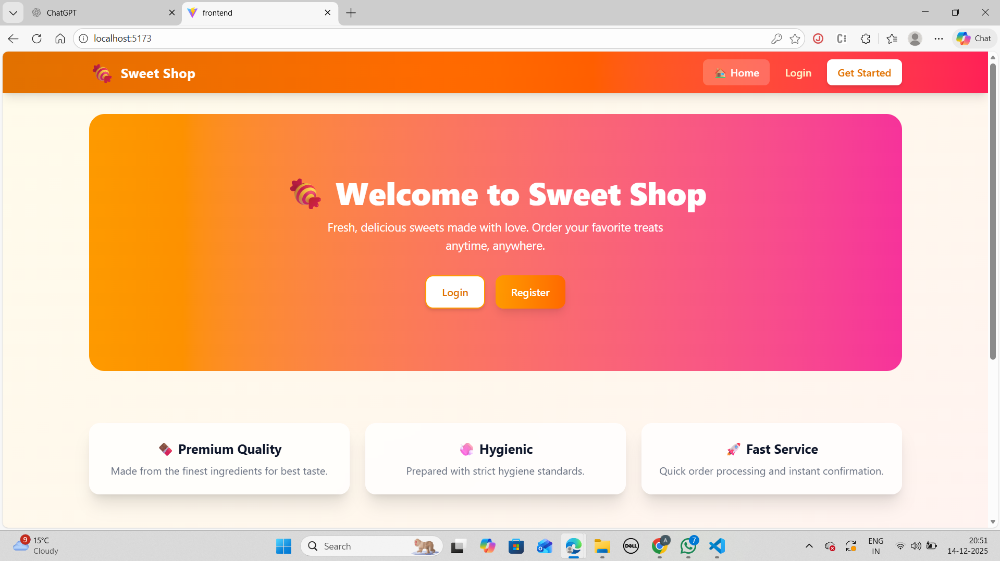
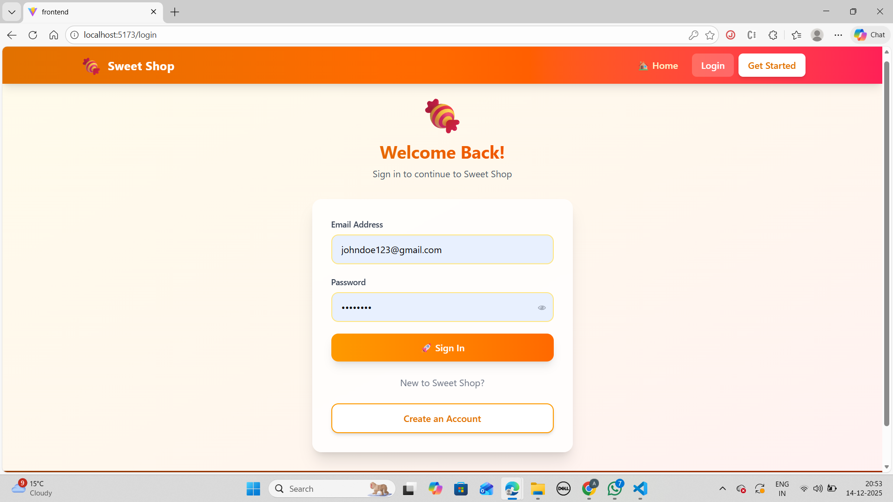
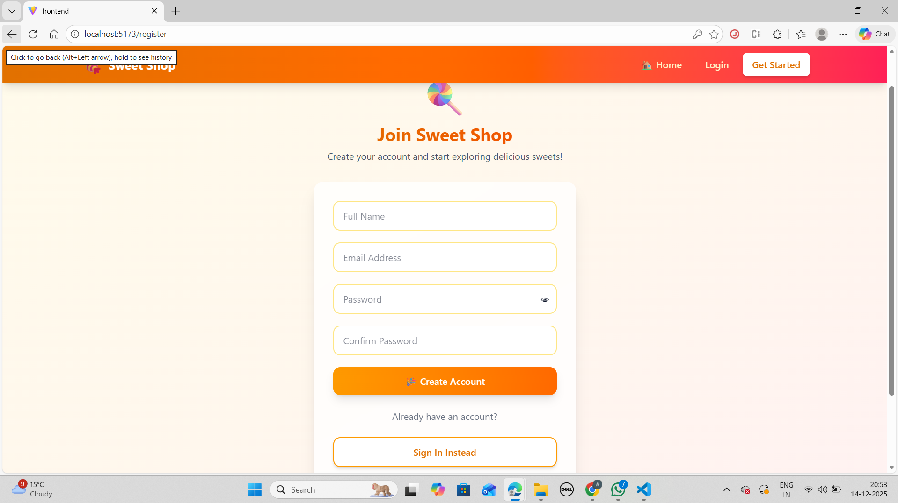
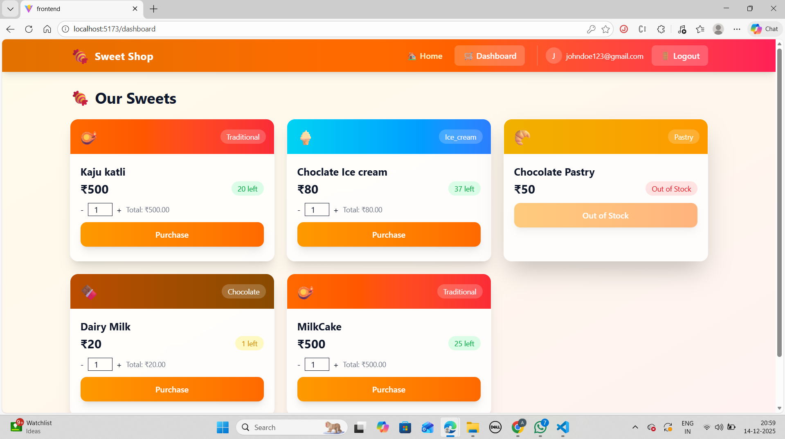
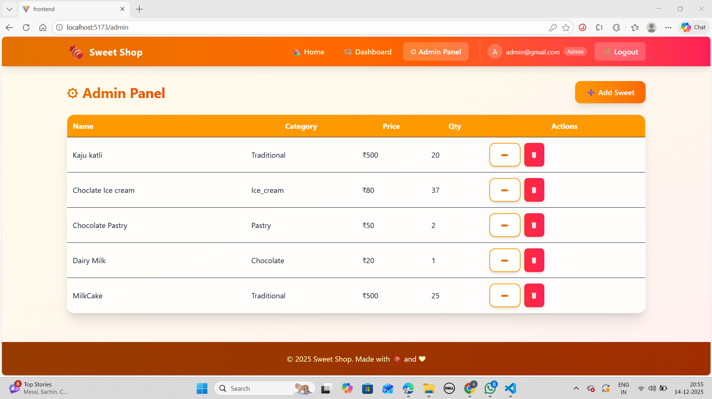
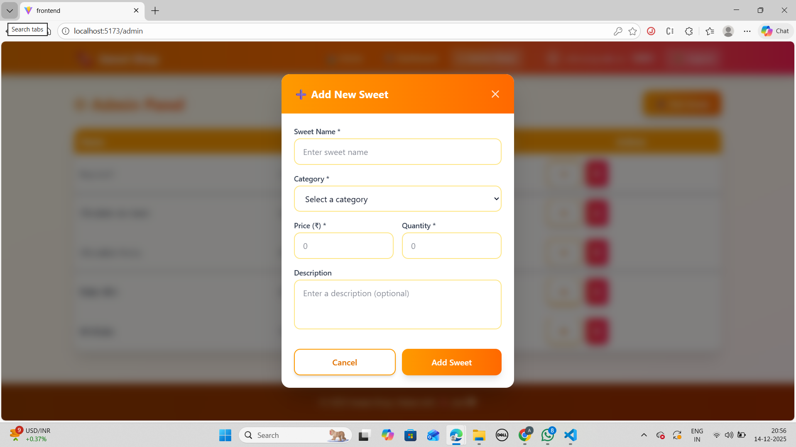
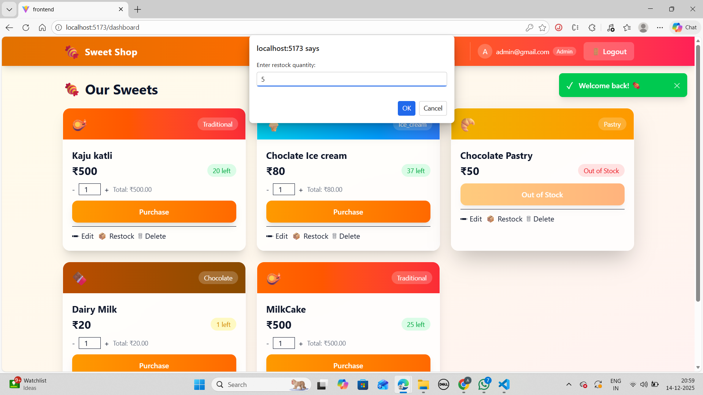
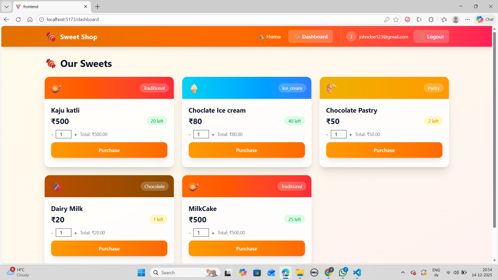
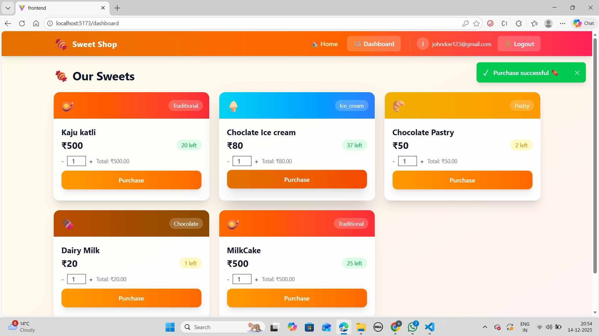

# 🍬 Sweet Shop Management System

A *full-stack Sweet Shop Management System* built using the *MERN stack, supporting **role-based access (Admin & User), **secure authentication, **inventory management, and **purchase workflows*.
The project follows *Test-Driven Development (TDD)* and *clean coding best practices*, ensuring scalability, maintainability, and production readiness.

---
## 🌐 Live Demo

| Platform | URL |
|----------|-----|
| *Frontend* | [## 🌐 Live Demo

| Platform | URL |
|----------|-----|
| *Frontend* | [https://sweet-shop-yt38.vercel.app](https://sweet-shop-yt38.vercel.app) |
| *Backend API* | [https://sweet-shop-swart.vercel.app/api/health](https://sweet-shop-swart.vercel.app/api/health) | 

---

## 📌 Features

### 👤 Authentication & Authorization

* User registration & login using *JWT*
* Role-based access control (*USER / ADMIN*)
* Protected routes (Frontend & Backend)
* Secure logout & token handling

### 🍭 Sweet Management

* View all sweets (authenticated users)
* Search & filter sweets by:

  * Name
  * Category
  * Price
* Purchase sweets with *stock validation*

#### 🔐 Admin-Only Actions

* Add new sweets
* Edit sweet details
* Delete sweets
* Restock inventory

### 🧑‍💼 Admin Capabilities

* Inventory control
* Stock restocking
* Sweet CRUD operations
* Role-based UI rendering

---

## Screenshots

### Home Page

### Login Page

### Create the account Page 

### User Login Page

### Admin Login Page

### Admin Panel

### Adding the Sweets Page

### Restock

### User Dashboard Page

### Puchasing the sweets

---

## 🛠 Tech Stack

### Frontend

* React (Vite)
* Tailwind CSS
* Axios
* React Router
* Context API

### Backend

* Node.js
* Express.js
* MongoDB & Mongoose
* JWT Authentication
* Middleware-based role authorization

### Testing

* Jest
* Supertest
* MongoDB Memory Server (isolated testing)

---

## 🧪 Test-Driven Development (TDD)

This project strictly follows *TDD principles*:

1. *Red* – Write failing tests first
2. *Green* – Implement minimal logic to pass tests
3. *Refactor* – Improve code quality without breaking tests

### Covered Areas

* Authentication flows
* Sweet CRUD operations
* Purchase logic
* Restock logic
* Authorization checks (Admin vs User)

> High-value test cases were prioritized over superficial coverage.

---

## 🧼 Clean Coding Practices

* SOLID principles
* Clear separation of concerns
  (Routes → Controllers → Models)
* Meaningful variable & function naming
* Centralized error handling
* Reusable middleware
* Consistent API response formats
* Inline comments only where logic is non-trivial

---

## 🔐 Security Practices

* Password hashing with *bcrypt*
* JWT-based authentication
* Role-based API protection
* Token validation middleware
* Backend-level authorization (not UI-only)

---

## 🗂 Project Structure

backend/
 ├── controllers/
 ├── routes/
 ├── models/
 ├── middlewares/
 ├── tests/
 └── server.js

frontend/
 ├── components/
 ├── pages/
 ├── context/
 ├── api/
 └── App.jsx

---

## 🚀 Getting Started

### 1️⃣ Clone the Repository

bash
git clone <repository-url>
cd sweet-shop

### 2️⃣ Backend Setup

bash
cd backend
npm install
npm run dev

### 3️⃣ Frontend Setup

bash
cd frontend
npm install
npm run dev

---

## 🧪 Run Tests

bash
cd backend
npm test

---

## 🌍 Environment Variables

Create a .env file inside the backend directory:

env
PORT=3000
MONGO_URI=your_mongodb_uri
JWT_SECRET=your_secret_key

---

## 🧠 AI Usage Policy Compliance

This project uses AI tools *responsibly and transparently*.

### How AI Was Used

* Generating boilerplate code
* Writing initial test cases
* Debugging logic errors
* Refactoring for clarity
* Improving documentation

### AI Co-Authorship in Git Commits

For every commit where AI assistance was used, the AI was added as a co-author.

#### ✅ Commit Message Example

bash
git commit -m "feat: Implement restock sweet functionality

Used an AI assistant to generate the initial controller logic and route structure. Manually refined validation and error handling.

Co-authored-by: ChatGPT <chatgpt@openai.com>"

This ensures *full transparency and ethical AI usage*.

---

## 📈 Git & Version Control Practices

* Small, frequent commits
* Descriptive commit messages
* Feature-based commits
* Clear history reflecting TDD workflow

---

## 🧪 Demo Credentials

### User

* *Email:* [user@example.com](mailto:user@example.com)
* *Password:* password123

### Admin

* *Email:* [admin@gmail.com](mailto:admin@gmail.com)
* *Password:* admin123

---

## 📌 Future Enhancements

* Cart system
* Order history
* Stock audit logs
* Email notifications
* Payment gateway integration

---

## 🏁 Conclusion

This project demonstrates:

* Strong backend fundamentals
* Clean, scalable architecture
* Secure authentication & authorization
* TDD-driven development
* Responsible AI usage
* Production-ready coding standards

---

## 👨‍💻 Author

*Arpit Wadhwa*